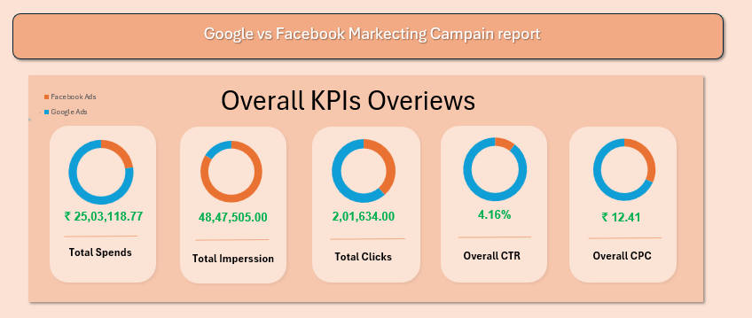
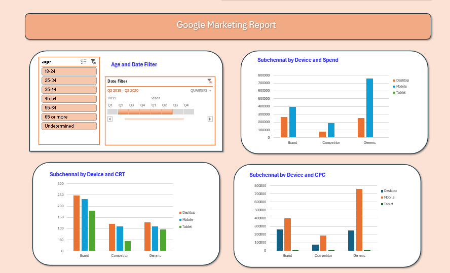
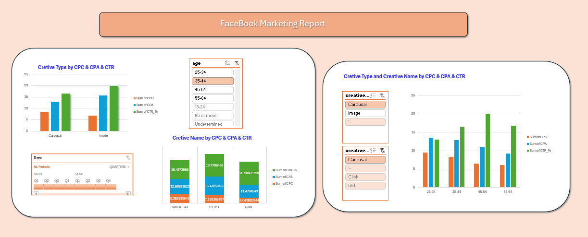

# 📊 Google Ads vs. Facebook Ads Performance Analytics Dashboard

An interactive Excel analytics report analyzing **₹25.03 Lakhs+** in ad spend across **Google Ads** and **Facebook Ads**. This dashboard evaluates cross-channel efficiency, impression reach vs. search intent, subchannel performance by device, creative variation impact, and demographic engagement.

---

## 📷 Raw File Preview


---
---

## 📷 Dashboard Preview


---
---

## 📂 Project Architecture & Screenshots

To reflect the dedicated reports, place your screenshot images inside a `screenshots/` directory:

| Report Tab | Screenshot File | Description |
| :--- | :--- | :--- |
| **1. Taking the Raw file to ETL and clean** | `Screenshrots/raw_data.png` | Transforming the raw data by Cleaning and Adding new metric cards . |
| **2. Executive KPI Overview** | `Screenshrots/KPI-ss.png` | Consolidated metric cards with platform distribution splits. |
| **3. Cross-Platform Comparison** | `Screenshrots/G-vs-F.png` | Budget distribution, monthly spend trends, conversion volume, and CPC fluctuations. |
| **4. Google Ads Deep Dive** | `Screenshrots/google_mkt.png` | Subchannel analysis (Brand, Competitor, Generic) by Device (Desktop, Mobile, Tablet). |
| **5. Facebook Ads Deep Dive** | `Screenshrots/fcebook_mkt.png` | Creative type (Image vs. Carousel) & name efficiency across age demographics. |

---

## 📈 Executive KPI Summary



| KPI | Total Value | Formula / Method | Platform Trend |
| :--- | :--- | :--- | :--- |
| **Total Spend** | **₹25,03,118.77** | `SUM(spends)` | Google Ads accounts for 77% of total budget |
| **Total Impressions** | **48,47,505.00** | `SUM(impressions)` | Facebook Ads drove the majority of impression reach |
| **Total Clicks** | **2,01,634.00** | `SUM(clicks)` | High click volume across both search & social channels |
| **Overall CTR** | **4.16%** | `SUM(clicks) / SUM(impressions)` | Driven by high brand search intent on Google |
| **Overall CPC** | **₹ 12.41** | `SUM(spends) / SUM(clicks)` | Google CPC normalized from ~₹45 down to <₹10 |

---

## 🔍 Key Business Insights & Analytical Findings

### 1. Cross-Platform Budget Allocation & Efficiency 


* **Budget Distribution:** Google Ads absorbed **77%** of the marketing budget (₹19.27L+), while Facebook Ads received **23%** (₹5.75L+).
* **Impression Reach vs. Click Intent:** Facebook Ads delivered massive top-of-funnel reach with over **4 Million+ impressions** at a lower overall spend. Conversely, Google Ads captured mid/bottom-funnel intent with higher click conversion density.
* **CPC Trends Over Time:** 
  * **Google Ads** initial campaigns (Oct–Nov 2019) saw high Cost Per Click peaking near **₹40–₹45**. Campaign optimization reduced Google CPC down below **₹10** by mid-2020.
  * **Facebook Ads** maintained a steady, low-cost CPC trajectory ranging between **₹3 and ₹10** across the entire campaign timeline.
* **Seasonal Spend Spike:** Both platforms experienced peak spending between **January 2020 and March 2020**, with Google Ads peaking at ~₹6 Lakhs/month in Jan–Feb.

---

### 2. Google Ads Channel & Device Analysis 


* **Device Spend Dominance:** **Mobile** is the primary driver of ad spend across all subchannels. **Generic Mobile** campaigns consumed the largest share of budget (~₹7.5 Lakhs), followed by **Brand Mobile** (~₹4.0 Lakhs).
* **Subchannel CTR Efficiency:** The **Brand** subchannel achieved the highest Click-Through Rate across all devices (Desktop CTR ~250, Mobile CTR ~235). This confirms strong consumer brand recall compared to Competitor and Generic terms.
* **CPC Efficiency by Subchannel:** Competitor bidding yielded lower overall click volumes relative to spend, while Generic Mobile drove the highest volume of paid traffic.

---

### 3. Facebook Ads Creative & Demographic Performance 


* **Creative Format Comparison:**
  * **Image Creatives** achieved higher Click-Through Rates (**~20% CTR**) compared to **Carousel Creatives (~16.5% CTR)**. However, Images incurred a higher Cost Per Acquisition (**CPA ~15.5**).
  * **Carousel Creatives** delivered lower CPA (**~12.8**) and stable engagement.
* **Top-Performing Creative Asset:** The **"Girl"** creative variation emerged as the single most efficient ad unit, generating the highest CTR (**20.28%**) at the lowest CPC (**₹5.04**).
* **Demographic Target Optimization:**
  * **Age 45–54:** Highest performing demographic bracket on Facebook, achieving **~20% CTR** with a low CPC (**~₹6.50**).
  * **Age 25–34:** Showed higher acquisition costs (**CPA ~13.5**) and higher CPC (**~₹9.50**) with lower engagement (**CTR ~13%**).

---

## 🛠️ Data Architecture & Calculated Metrics

To ensure mathematical accuracy across aggregated Pivot Tables, ratios were constructed using explicit **Calculated Fields**:

```excel
CPC (Cost Per Click)     = spends / clicks
CTR (Click-Through Rate) = clicks / impressions
CPM (Cost Per Mille)      = (spends / impressions) * 1000
CPA (Cost Per Action)    = spends / link_clicks
```


---


## 🎓  Guide

Anyone can use this repository to practice Excel dashboarding! The repository provides both the raw dataset for self-practice and the completed solution for reference:

* 📄 **`Data/Raw_File.xlsx`**: Raw campaign dataset containing uncleaned data across both platforms. Use this file to practice data cleaning, Create calculated measures (CPC, CTR, CPM, CPA), building Pivot Tables, and designing custom dashboard layouts from scratch.

* 📊 **`Solution_final.xlsb.xlsx`**: The completed, interactive Excel dashboard featuring calculated fields, dynamic slicers, time-series charts, and dedicated analysis tabs. Use this as a reference solution.

---

## 📂 My Repository Architecture

```text
google-vs-facebook-ads-dashboard/
├── Data/
│   └── Raw_File.xlsx               <-- Raw dataset for hands-on practice
├── screenshots/
│   ├── KPI-ss.png                   <-- Executive KPI overview
│   ├── G-vs-F.png                   <-- Platform comparison report
│   ├── google_mkt.png               <-- Google Ads device deep dive
│   └── fcebook_mkt.png              <-- Facebook Ads deep dive
├── Solution_final.xlsb.xlsx       <-- Final reference solution dashboard
└── README.md                        <-- Project documentation 
```


