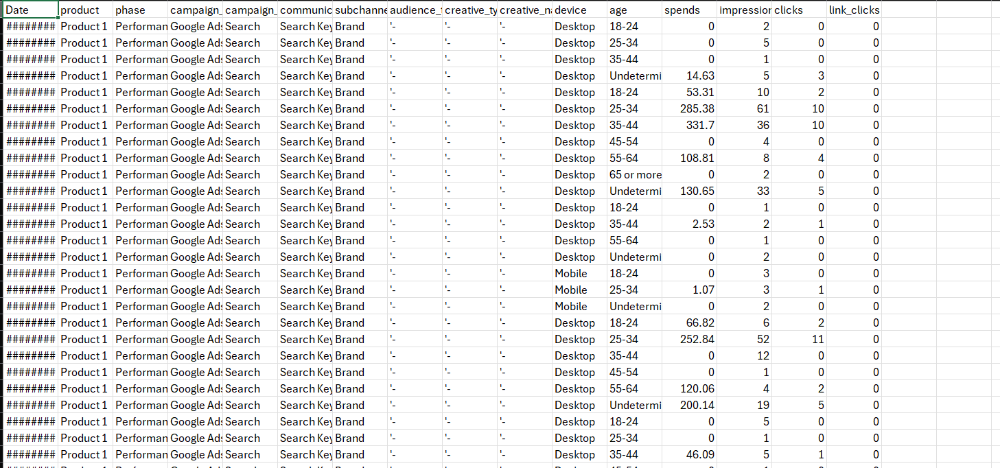
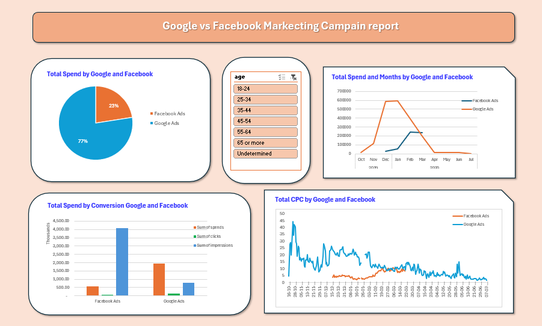

# 📊 Google Ads vs. Facebook Ads Performance Analytics Dashboard

An interactive Excel analytics report analyzing **₹25.03 Lakhs+** in ad spend across **Google Ads** and **Facebook Ads**. This dashboard evaluates cross-channel efficiency, impression reach vs. search intent, subchannel performance by device, creative variation impact, and demographic engagement.

---

## 📷 Raw File Preview



---
---

## 📷 Dashboard Preview



---
---

## 📂 Project Architecture & Screenshots

To reflect the dedicated reports, place your screenshot images inside a `screenshots/` directory:

| Report Tab | Screenshot File | Description |
| :--- | :--- | :--- |
| **1. Executive KPI Overview** | `screenshots/KPI-ss.png` | Consolidated metric cards with platform distribution split[cite: 6]. |
| **2. Cross-Platform Comparison** | `screenshots/G-vs-F.png` | Budget distribution, monthly spend trends, conversion volume, and CPC fluctuations[cite: 5]. |
| **3. Google Ads Deep Dive** | `screenshots/google_mkt.png` | Subchannel analysis (Brand, Competitor, Generic) by Device (Desktop, Mobile, Tablet). |
| **4. Facebook Ads Deep Dive** | `screenshots/fcebook_mkt.png` | Creative type (Image vs. Carousel) & name efficiency across age demographics. |

---

## 📈 Executive KPI Summary


| KPI | Total Value | Formula / Method | Platform Trend |
| :--- | :--- | :--- | :--- |
| **Total Spend** | **₹ 25,03,118.77** | `SUM(spends)` | Google Ads accounts for 77% of total budget[cite: 5, 6]. |
| **Total Impressions** | **48,47,505.00** | `SUM(impressions)` | Facebook Ads drove the majority of impression reach[cite: 5, 6]. |
| **Total Clicks** | **2,01,634.00** | `SUM(clicks)` | High click volume across both search & social channels[cite: 5, 6]. |
| **Overall CTR** | **4.16%** | `SUM(clicks) / SUM(impressions)` | Driven by high brand search intent on Google[cite: 4, 6]. |
| **Overall CPC** | **₹ 12.41** | `SUM(spends) / SUM(clicks)` | Google CPC normalized from ~₹45 down to <₹10[cite: 5, 6]. |

---

## 🔍 Key Business Insights & Analytical Findings

### 1. Cross-Platform Budget Allocation & Efficiency (`G-vs-F.png`)


* **Budget Distribution:** Google Ads absorbed **77%** of the marketing budget (₹19.27L+), while Facebook Ads received **23%** (₹5.75L+)[cite: 5].
* **Impression Reach vs. Click Intent:** Facebook Ads delivered massive top-of-funnel reach with over **4 Million+ impressions** at a lower overall spend[cite: 5]. Conversely, Google Ads captured mid/bottom-funnel intent with higher click conversion density[cite: 5].
* **CPC Trends Over Time:** 
  * **Google Ads** initial campaigns (Oct–Nov 2019) saw high Cost Per Click peaking near **₹40–₹45**[cite: 5]. Campaign optimization reduced Google CPC down below **₹10** by mid-2020[cite: 5].
  * **Facebook Ads** maintained a steady, low-cost CPC trajectory ranging between **₹3 and ₹10** across the entire campaign timeline[cite: 5].
* **Seasonal Spend Spike:** Both platforms experienced peak spending between **January 2020 and March 2020**, with Google Ads peaking at ~₹6 Lakhs/month in Jan–Feb[cite: 5].

---

### 2. Google Ads Channel & Device Analysis (`google_mkt.png`)


* **Device Spend Dominance:** **Mobile** is the primary driver of ad spend across all subchannels[cite: 4]. **Generic Mobile** campaigns consumed the largest share of budget (~₹7.5 Lakhs), followed by **Brand Mobile** (~₹4.0 Lakhs)[cite: 4].
* **Subchannel CTR Efficiency:** The **Brand** subchannel achieved the highest Click-Through Rate across all devices (Desktop CTR ~250, Mobile CTR ~235)[cite: 4]. This confirms strong consumer brand recall compared to Competitor and Generic terms[cite: 4].
* **CPC Efficiency by Subchannel:** Competitor bidding yielded lower overall click volumes relative to spend, while Generic Mobile drove the highest volume of paid traffic[cite: 4].

---

### 3. Facebook Ads Creative & Demographic Performance (`fcebook_mkt.png`)


* **Creative Format Comparison:**
  * **Image Creatives** achieved higher Click-Through Rates (**~20% CTR**) compared to **Carousel Creatives (~16.5% CTR)**[cite: 3]. However, Images incurred a higher Cost Per Acquisition (**CPA ~15.5**)[cite: 3].
  * **Carousel Creatives** delivered lower CPA (**~12.8**) and stable engagement[cite: 3].
* **Top-Performing Creative Asset:** The **"Girl"** creative variation emerged as the single most efficient ad unit, generating the highest CTR (**20.28%**) at the lowest CPC (**₹5.04**)[cite: 3].
* **Demographic Target Optimization:**
  * **Age 45–54:** Highest performing demographic bracket on Facebook, achieving **~20% CTR** with a low CPC (**~₹6.50**)[cite: 3].
  * **Age 25–34:** Showed higher acquisition costs (**CPA ~13.5**) and higher CPC (**~₹9.50**) with lower engagement (**CTR ~13%**)[cite: 3].

---

## 🛠️ Data Architecture & Calculated Metrics

To ensure mathematical accuracy across aggregated Pivot Tables, ratios were constructed using explicit **Calculated Fields**:

```excel
CPC (Cost Per Click)     = spends / clicks
CTR (Click-Through Rate) = clicks / impressions
CPM (Cost Per Mille)      = (spends / impressions) * 1000
CPA (Cost Per Action)    = spends / link_clicks